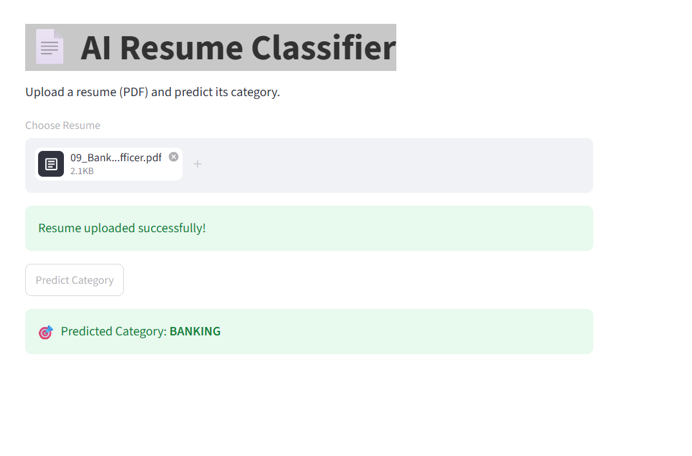

# AI Resume Classifier

An AI-powered Resume Classification application built using Python, NLP, Machine Learning, OCR, and Streamlit.

## Application Preview

## Features

- Upload PDF Resume
- OCR Text Extraction
- NLP Preprocessing
- Resume Classification using Machine Learning
- Streamlit User Interface

## Tech Stack

- Python
- Streamlit
- Scikit-learn
- spaCy
- Tesseract OCR
- PDF2Image
- Joblib
